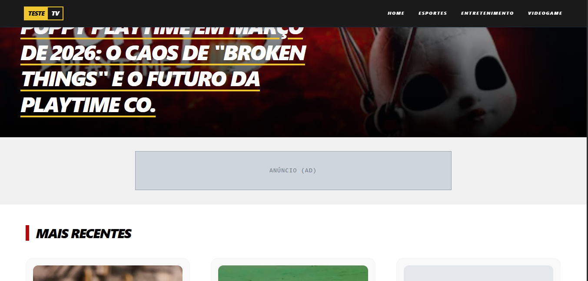
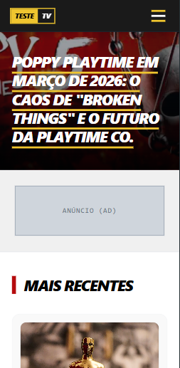

# Teste TV | Protótipo de Performance e Web Site

Este projeto é um ambiente de testes para validar a arquitetura de um blog de notícias 
escalável. Aqui, eu experimento integrações entre **DatoCMS**, **Next.js** e **TypeScript**, 
garantindo uma tipagem robusta e design prático com **Tailwind CSS**.

### Tecnologias (Stack)

* **Core:** Next.js (App Router), React, TypeScript.
* **Gestão de Conteúdo:** DatoCMS (Headless CMS) com StructuredText.
* **Estilização:**  Tailwind CSS (Implementação de layouts fluidos e Mobile-First).
* **SEO:** Implementação dinâmica de metadados e OpenGraph.

### Validação

* **Renderização de Blocos Dinâmicos:** Implementação de lógica para inserir anúncios (AdMateria) de forma automática no meio do conteúdo estruturado.
* **Tipagem Avançada de CMS:** Resolução de conflitos de tipagem entre API e Componentes, garantindo Type Safety sem depender de any (onde possível).
* **Sistema de Recomendações:** Algoritmo de filtragem por categoria no frontend para aumentar o tempo de permanência do usuário.
* **Arquitetura de Dados:** Mapeamento de dados do backend (DatoCMS) para componentes de interface.

### Estrutura de páginas
```
src/
 ├── components/    # UI Reutilizável (Navbar, Footer, CardNoticia)
 ├── lib/           # Conexão com APIs (DatoCMS)
 ├── types/         # Onde a mágica da tipagem acontece (PostDato, etc)
 └── app/           # Páginas e roteamento (Next.js App Router)
```

## Interface do Projeto

### Desktop


### Mobile

